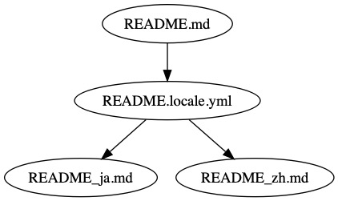
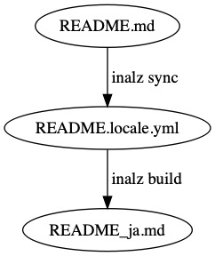

# Inalz

[](https://travis-ci.org/FujiHaruka/inalz)
[](https://badge.fury.io/js/inalz)


Inalz は、 Markdown ドキュメントの翻訳をメンテナブルにするための i18n ツールです。

## なぜ Inalz が必要か

Markdown ドキュメントを多言語対応するには、普通、言語ごとに Markdown ファイルを用意します。たとえば、`README.md` を元にして日本語の `README_ja.md`、中国語の `README_zh.md` を作成するといったやり方で、最初に書いたドキュメントを元にそれぞれの翻訳ドキュメントを作成します。ところが、このやり方で翻訳作業を進めると、次のような問題があります。

+ 翻訳ドキュメントの更新が難しい
+ ドキュメントに無用の重複が生じる
+ 元の文と翻訳文の比較が難しい

それぞれの問題点について少し説明します。

### 翻訳ドキュメントの更新が難しい

翻訳ドキュメントが古くなる問題はいろいろなライブラリのドキュメントで起きています。翻訳ドキュメントの内容が英語の最新版ドキュメントよりも古いバージョンのものになると、ドキュメントとして役に立たないだけでなく無用な誤解を生んでしまいます。翻訳ドキュメントを読んでいるうちに翻訳が古いバージョンのものあることに気がついて、原文を読まざるをえなくなり、結果的に余計遠回りになるといったことは、英語ネイティブでない人には誰でも経験があると思います。

また、たいていは役割分担がなされていて、元言語のドキュメントを書く人とそれを翻訳する人は違っています。その場合、元ドキュメントを更新したら翻訳する人にそのことを伝えなくてはなりません。翻訳する人が更新箇所を知るには Git の差分を見ることになりますが、複数のコミットやプルリクエストにまたがってドキュメントが更新されていると、更新すべき文を探すのも一苦労です。

### ドキュメントに無用の重複が生じる

一般的に、プログラマは重複を嫌います。**DRY (Don't repeat yourself)** の原則が語っているように、無用の重複があると変更が困難になり、メンテナビリティが下がります。

翻訳ドキュメントを書く素朴な手順は、次のようなものでしょう。

1. 元ドキュメント `README.md` をコピーして翻訳ドキュメント `README_ja.md` を作る
1. 翻訳ドキュメント `README_ja.md` のテキストを翻訳文に一文ずつ置き換える

これは DRY の原則に違反しています。このやり方では、ドキュメントに無用の重複が生じます。その一番大きなものがコードブロックです。ライブラリのドキュメントにはサンプルコードなどが書かれたコードブロックが多用されますが、ほとんどの場合、コードブロックは翻訳不要です。翻訳者はコードブロックには手を付けずに説明文だけを翻訳しますが、その結果、コードブロックは無用の重複として残ることになります。

想像してみましょう。元ドキュメント `README.md` のサンプルコードにタイポが紛れていることが発覚したら、`README.md`だけでなく、`README_ja.md` と `README_zh.md` それぞれのサンプルコードを修正して回らなくてはなりません。

### 元の文と翻訳文の比較が難しい

翻訳ドキュメントが完成したとして、正しく翻訳できているかどうかを確認するにはどうすればいいでしょうか。翻訳ドキュメントと元ドキュメントの 2 ファイルをエディタで開いて並べ、見比べることになります。これでは効率よく翻訳の正しさをチェックできません。

### Inalz による解決

要約すると、以上の問題は翻訳ドキュメントのメンテナンスが難しいということです。それを解決する Inalz のアプローチは、元ドキュメントと翻訳ドキュメントの間に中間ファイルを用意するというものです。



はじめに元ドキュメント `README.md` があります。そして、原文と翻訳文をマッピングするための中間ファイルが `README.locale.yml` で、Locale ファイルといいます。Locale ファイルは YAML で書かれ、シンプルに原文と翻訳文が一文ずつ並べられます。Locale ファイルで翻訳作業を行い、Locale ファイルから翻訳ドキュメント `README_ja.md` と `README_zh.md` を出力します。

Locale ファイルの特徴は次のとおりです。

+ 元ドキュメントが更新されると、対象の翻訳文に `outdated` のラベルが自動で付く
  + そのため、更新すべき文がすぐにわかる
+ コードブロックは翻訳対象とせず、Locale ファイルに含めない
  + そのため、無用の重複を避けられる
+ 原文と翻訳文が一文ずつ並ぶ
  + そのため、翻訳作業と確認が容易である

また、中間ファイルを置くことで、ドキュメント作成の役割分担が明確になります。

+ 元ドキュメントを書く人は翻訳のことを気にせず Markdown で自由に書ける
+ 翻訳する人は元ドキュメントの構造を気にせず一文ずつの翻訳に集中できる

いわゆる**関心の分離**です。これが Inalz による解決です。

## Getting started

### インストール

```bash
$ npm install inalz -g
```

### 最初の翻訳

ここで学ぶのは、2 つのコマンドです。

+ `inalz sync`
+ `inalz build`

概念図を示しておきます。



[example/helloworld](./example/helloworld) に例がありますが、最小限必要なのは次のファイルです。

```
example/helloworld/
├── README.md
└── inalz.yml
```

+ `README.md` ... 元ドキュメント。この例では簡単のため 1 つのファイルだけです
+ `inalz.yml` ... Inalz の設定ファイル

`README.md` の内容は以下です。

<pre lang="no-highlight"><code># Hello world

This is a hello-world document.

```bash
$ inalz sync
$ inalz build
```
</code></pre>

`inalz.yml` の内容は以下です。

```yml
lang:
  source: en
  targets:
    - ja
documents:
  - source: README.md
    targets:
      ja: README_ja.md
    locale: README.locale.yml
```

設定ファイルの読み方を説明します。

+ `lang`: 言語の設定。ここでは、元ドキュメントが英語 (`en`)、翻訳ドキュメントが日本語 (`ja`) です
+ `documents`: ドキュメントファイルのマッピング。ここでは、元ドキュメント `README.md` には Locale ファイル `README.locale.yml` が対応し、翻訳ドキュメント `README_ja.md` が出力されます

`inalz.yml` はプロジェクトルートに置きます。設定ファイルは JSON もサポートしているので、`inalz.json` としても構いません。


`example/helloworld/` ディレクトリに移動して、Inalz コマンドを実行しましょう。

```
$ cd example/helloworld
$ inalz sync
```

すると、`README.locale.yml` ファイルが出力されます。

```
example/helloworld/
├── README.locale.yml
├── README.md
└── inalz.yml
```

`inalz sync` コマンドは、`inalz.yml` の設定をもとに Locale ファイルを生成・同期します。ここで生成される Locale ファイルは `README.locale.yml` です。

`inalz sync` コマンドは冪等です。つまり、元ドキュメントに変更がなければ、すでにある Locale ファイルは変更されません。


`README.locale.yml` の内容は以下のようになるはずです。

```yml
texts:
  en: Hello world
  ja: __COPY__
---
texts:
  en: This is a hello-world document.
  ja: __COPY__
```

Locale ファイルは、パラグラフ単位での文章の対応を表しています。デフォルトの `__COPY__` は、元の文章を置き換えずにそのまま使うことを意味しています。また、コードブロックは無視されます。

`README.locale.yml` の一部を編集してみましょう。

```yml
texts:
  en: Hello world
  ja: __COPY__
---
texts:
  en: This is a hello-world document.
  ja: これはハローワールドのドキュメントです。
```

翻訳作業が完了したので、翻訳ドキュメントファイルを出力します。もう一つの Inalz コマンドを実行しましょう。

```console
$ inalz build
```

すると、翻訳ドキュメント `README_ja.md` が新たに出力されます。

```
example/helloworld/
├── README.locale.yml
├── README.md
├── README_ja.md
└── inalz.yml
```

`inalz build` コマンドは、Locale ファイルと元ドキュメントを参照して、翻訳ドキュメントを出力します。

`README_ja.md` の内容は以下のようになるはずです。

<pre lang="no-highlight"><code># Hello world

これはハローワールドのドキュメントです。

```bash
$ inalz sync
$ inalz build
```
</code></pre>

日本語訳 `README_ja.md` が完成しました！　翻訳ドキュメントは元ドキュメントの英文を単純に置換したものなので、 Markdown ドキュメント構造を保持しています。

### ドキュメントの更新

では、ドキュメントのメンテナンスをしましょう。

たとえば、`README.md` を次のように更新します。

<pre lang="no-highlight"><code># Hello world

This is an awesome hello-world document.

A new paragraph is added.

```bash
$ inalz sync
$ inalz build
```
</code></pre>

差分を確認します。

```diff
-This is a hello-world document.
+This is an awesome hello-world document.
+
+A new paragraph is added.
```

既存のパラグラフが変更され、新たなパラグラフも追加されています。

元ドキュメントを更新したら、`inalz sync` コマンドで Locale ファイルに変更を反映します。

```
$ inalz sync
```

`README.locale.yml` は以下のようになるはずです。

```yml
texts:
  en: Hello world
  ja: __COPY__
---
meta:
  outdated: true
texts:
  en: This is an awesome hello-world document.
  ja: これはハローワールドのドキュメントです。
---
texts:
  en: A new paragraph is added.
  ja: __COPY__
```

観察すると次のことがわかります。

+ 更新されたパラグラフは `meta.outdated` が `true` になる
+ 新しいパラグラフが追加される

`meta.outdated` は注釈です。`inalz build` には影響しませんが、そのパラグラフの翻訳が古くなっていることを教えてくれます。

更新のための翻訳作業では、以下のことを行います。

+ 更新されたパラグラフを翻訳し直し、`meta.outdated` を削除する
+ 新しいパラグラフを翻訳する

`README.locale.yml` を以下のように更新します。

```yml
texts:
  en: Hello world
  ja: __COPY__
---
texts:
  en: This is an awesome hello-world document.
  ja: これは素晴らしいハローワールドのドキュメントです。
---
texts:
  en: A new paragraph is added.
  ja: 新しいパラグラフが追加されます。
```

それから、翻訳ドキュメントを出力します。

```
$ inalz build
```

`README_ja.md` は以下のようになるはずです。

<pre lang="no-highlight"><code># Hello world

これは素晴らしいハローワールドのドキュメントです。

新しいパラグラフが追加されます。

```bash
$ inalz sync
$ inalz build
```
</code></pre>

このように、Locale ファイルを介してドキュメントを更新します。翻訳が古くなったパラグラフは Locale ファイルが教えてくれるので、ドキュメントのメンテナンスが容易です。
