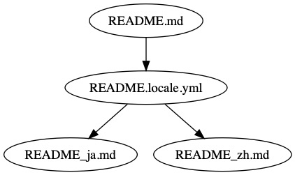

# Inalz

[](https://travis-ci.org/FujiHaruka/inalz)
[](https://badge.fury.io/js/inalz)


Inalz は、 Markdown ドキュメントの翻訳をメンテナブルにするための i18n ツールです。

## なぜ Inalz が必要か

Markdown ドキュメントを多言語対応させるには、言語ごとに Markdown ファイルを用意するのがよくある流儀です。たとえば、`README.md` を元にして日本語の `README_ja.md`、中国語の `README_zh.md` を作成するといったやり方で、最初に書いたドキュメントを元にしてそれぞれの翻訳ドキュメントを作成します。ところが、これで翻訳作業を進めると、次のような問題があります。

+ 元の `README.md` を更新すると翻訳ドキュメントの内容は古くなってしまう
+ ドキュメントに不要な重複が発生する
+ 元の文と翻訳文を比較するには 2 つのファイルを見比べなくてはいけない

それぞれの問題点について少し説明します。

#### 元の `README.md` を更新すると翻訳ドキュメントの内容は古くなってしまう

翻訳ドキュメントが古くなる問題はいろいろなライブラリのドキュメントで起きています。翻訳ドキュメントの内容が英語の最新版ドキュメントよりも古いバージョンのものになると、ドキュメントとして役に立たないだけでなく無用な誤解を生んでしまいます。翻訳ドキュメントを読んでいるうちに古いバージョンの翻訳であることに気がついて、原文を読まざるをえなくなり、余計遠回りになるといったことは、英語ネイティブでない人には誰でも経験があると思います。

また、たいていは役割分担がなされていて、元言語のドキュメントを書く人とそれを翻訳する人は違っています。すると、元ドキュメントを更新したら翻訳する人にそのことを伝えなくてはなりません。翻訳する人は Git の差分を見ながら翻訳ドキュメントを更新することになりますが、これもまた労力です。

#### ドキュメントに不要な重複が発生する

一般的に、プログラマは重複を嫌います。**DRY (Don't repeat yourself)** の原則が語っているように、不要な重複があると変更が困難になり、メンテナビリティが下がります。

ドキュメントの翻訳はどうなっているでしょうか。翻訳ドキュメントを書く素朴な手順は、次のようなものでしょう。

1. 元ドキュメント `README.md` をコピーして翻訳ドキュメント `README_ja.md` を作る
1. 翻訳ドキュメント `README_ja.md` のテキストを翻訳文に一文ずつ置き換える

これは DRY の原則に違反しています。このやり方では、ドキュメントに不要な重複が生じます。その一番大きなものがコードブロックです。ライブラリのドキュメントにはサンプルコードなどが書かれたコードブロックが多用されますが、ほとんどの場合、コードブロックは翻訳不要です。翻訳者はコードブロックには手を付けずに説明文だけを翻訳しますが、その結果、コードブロックは不要な重複として残ることになります。

想像してみましょう。元ドキュメント `README.md` のサンプルコードにタイポが紛れていることが発覚したら、`README.md`だけでなく、`README_ja.md` と `README_zh.md` それぞれのサンプルコードを修正して回らなくてはなりません。

#### 原文と翻訳文を比較するには 2 つのファイルを見比べなくてはいけない

翻訳ドキュメントが完成したとして、正しく翻訳できているかどうかを確認するにはどうすればいいでしょうか。翻訳ドキュメントにある文に対応する原文は元ドキュメントにあります。翻訳ドキュメントと元ドキュメントの 2 ファイルをエディタで開いて並べ、見比べることになります。これでは効率よく翻訳の正しさをチェックできません。

### Inalz による解決

以上のような問題を解決する Inalz のアプローチは、元ドキュメントと翻訳ドキュメントの間に中間ファイルを用意するというものです。

図にするとこのようになります。



はじめに元ドキュメント `README.md` があります。そして、原文と翻訳文をマッピングするための中間ファイルが `README.locale.yml` で、Locale ファイルといいます。Locale ファイルは YAML で書かれ、シンプルに原文と翻訳文が一文ずつ並べられます。Locale ファイルで翻訳作業を行い、完成したら翻訳ドキュメント `README_ja.md` と `README_zh.md` を出力します。

Locale ファイルの特徴は次のようなものです。

+ 元ドキュメントが更新され、翻訳文が古くなると、`outdated` のラベルが自動で付く
+ コードブロックは翻訳対象とせず、Locale ファイルに含めない
+ 原文と翻訳文が一文ずつ並ぶため、翻訳作業と確認が容易である

これらの特徴は、上に挙げた問題をうまく解決しています。

+ 古い翻訳文に `outdated` のラベルが付くため、更新すべき翻訳文がすぐにわかる
+ コードブロックを翻訳対象から除外するため、不要な重複を避けられる
+ 原文と翻訳文を見比べるには Locale ファイルを見ればよい

さらに、中間ファイルを置くことで、ドキュメント作成の役割分担が明確になります。

+ 元ドキュメントを書く人は翻訳のことを気にせず Markdown で自由に書ける
+ 翻訳する人は元ドキュメントの構造を気にせず一文ずつの翻訳に集中できる

いわゆる**関心の分離**です。このようにして、Inalz は Makdown ドキュメントの翻訳をメンテナブルにします。

## チュートリアル

Inalz を `npm` でインストールしてください。

```bash
$ npm install inalz -g
```

Inalz を始めるために必要なのは、Markdown ドキュメントと、その翻訳先を指示するための設定ファイル `inalz.yml` です。

たとえば、英語の `README.md` を日本語の `README.ja.md` に対応させるためには、以下のような設定を `inalz.yml` に書いて、プロジェクトルートに置きます。

```yml
lang:
  source: en
  targets:
    - ja
documents:
  - linkMode: path
    source: README.md
    targets:
      ja: README.ja.md
    locale: .README.yml
```

例として、次のような `README.md` を書いておきます。

```md
# Hello world

This is a hello-world document.
```


カレントディレクトリには次の 2 つのファイルがあります。

```
.
├── inalz.yml
└── README.md
```

ここで、 Inalz コマンドを実行しましょう。

```bash
$ inalz sync
```

`inalz sync` コマンドは、`inalz.yml` の設定をもとに Locale ファイルを生成します。ここで生成される Locale ファイルは 1 つだけで、`locale` で設定した `.README.yml` です。

```
.
├── .README.yml
├── inalz.yml
└── README.md
```

Locale ファイル `.README.yml` は次のようになっているはずです。

```yml
texts:
  en: Hello world
  ja: __COPY__
---
texts:
  en: This is a hello-world document.
  ja: __COPY__
```

Locale ファイルは、パラグラフ単位での本文と訳文の対応を表しています。デフォルトの `__COPY__` は、元の文章を置き換えずにそのまま使うことを意味しています。

`.README.yml` を次のように編集してみましょう。

```yml
texts:
  en: Hello world
  ja: ハローワールド
---
texts:
  en: This is a hello-world document.
  ja: これはハローワールドのドキュメントです。
```

次に、翻訳ドキュメントファイルを出力します。そのためには別の Inalz コマンドを実行しましょう。

```
$ inalz build
```

`inalz build` コマンドは、Locale ファイルと元ドキュメントを参照して、翻訳ドキュメントを出力します。ここでは `README.ja.md` が出力されます。

```
.
├── .README.yml
├── inalz.yml
├── README.ja.md
└── README.md
```

ファイルの内容は次のようになっているはずです。

```md
# ハローワールド

これはハローワールドのドキュメントです。
```

`README.md` の日本語訳が完成しました！　`README.ja.md` は、元の Markdown ファイルのドキュメント構造を維持しています。`inalz build` コマンドの仕事は単純で、ただ元の Markdown ファイルの文字列を置換するだけです。

